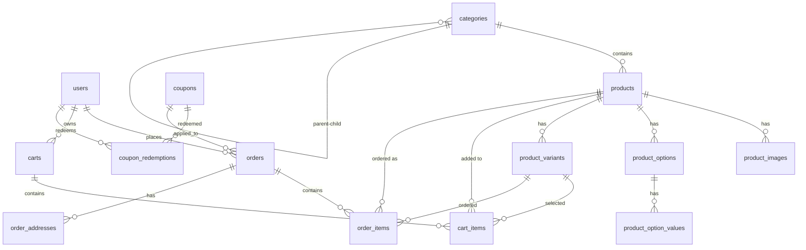

# Design Document

## Overview

Lunora is a modern jewelry e-commerce platform built with Laravel 11 that provides a seamless shopping experience for customers and a comprehensive management interface for administrators. The system follows a traditional MVC architecture with additional service layers for complex business logic, utilizing MySQL for data persistence and local file storage for product images.

The platform is designed to handle the complete e-commerce lifecycle from product browsing to order fulfillment, with special considerations for jewelry-specific features like customization options and variant management.

## Architecture

### System Architecture

The application follows a layered architecture pattern:

```
┌─────────────────────────────────────────────────────────────┐
│                    Presentation Layer                        │
│  ┌─────────────────┐  ┌─────────────────┐  ┌──────────────┐ │
│  │   Blade Views   │  │  API Routes     │  │  Admin Panel │ │
│  │   (Tailwind)    │  │  (Sanctum)      │  │  (Custom)    │ │
│  └─────────────────┘  └─────────────────┘  └──────────────┘ │
└─────────────────────────────────────────────────────────────┘
┌─────────────────────────────────────────────────────────────┐
│                    Application Layer                         │
│  ┌─────────────────┐  ┌─────────────────┐  ┌──────────────┐ │
│  │   Controllers   │  │    Services     │  │ Middleware   │ │
│  │                 │  │                 │  │              │ │
│  └─────────────────┘  └─────────────────┘  └──────────────┘ │
└─────────────────────────────────────────────────────────────┘
┌─────────────────────────────────────────────────────────────┐
│                     Domain Layer                            │
│  ┌─────────────────┐  ┌─────────────────┐  ┌──────────────┐ │
│  │    Models       │  │   Repositories  │  │    Events    │ │
│  │  (Eloquent)     │  │                 │  │              │ │
│  └─────────────────┘  └─────────────────┘  └──────────────┘ │
└─────────────────────────────────────────────────────────────┘
┌─────────────────────────────────────────────────────────────┐
│                Infrastructure Layer                         │
│  ┌─────────────────┐  ┌─────────────────┐  ┌──────────────┐ │
│  │     MySQL       │  │  File Storage   │  │     SMTP     │ │
│  │   Database      │  │    (Local)      │  │     Mail     │ │
│  └─────────────────┘  └─────────────────┘  └──────────────┘ │
└─────────────────────────────────────────────────────────────┘
```

### Technology Stack

-   **Backend Framework**: Laravel 11 with PHP 8.3
-   **Database**: MySQL 8.0
-   **Authentication**: Laravel Sanctum + Laravel Socialite (Google)
-   **Frontend**: Blade templates with Tailwind CSS
-   **Admin Panel**: Custom Blade templates with Tailwind CSS
-   **File Storage**: Local filesystem with public disk
-   **Email**: SMTP via host provider
-   **Image Processing**: Intervention Image for thumbnails

### Database Design

The database follows a normalized structure optimized for e-commerce operations:



## Components and Interfaces

### Core Models and Relationships

#### User Model

```php
class User extends Authenticatable
{
    protected $fillable = ['name', 'email', 'password', 'google_id', 'avatar_url', 'role', 'is_active'];
    protected $casts = ['email_verified_at' => 'datetime', 'last_login_at' => 'datetime', 'is_active' => 'boolean'];

    public function orders(): HasMany;
    public function carts(): HasMany;
    public function couponRedemptions(): HasMany;
    public function isAdmin(): bool;
    public function isCustomer(): bool;
}
```

#### Product Model

```php
class Product extends Model
{
    protected $fillable = ['category_id', 'name', 'slug', 'sku', 'description', 'material', 'brand', 'price_pkr', 'compare_at_price_pkr', 'stock', 'is_active', 'is_featured'];
    protected $casts = ['price_pkr' => 'integer', 'compare_at_price_pkr' => 'integer', 'stock' => 'integer', 'is_active' => 'boolean', 'is_featured' => 'boolean'];

    public function category(): BelongsTo;
    public function images(): HasMany;
    public function options(): HasMany;
    public function variants(): HasMany;
    public function cartItems(): HasMany;
    public function orderItems(): HasMany;

    public function getFormattedPriceAttribute(): string;
    public function isInStock(): bool;
    public function hasVariants(): bool;
}
```

#### Order Model

```php
class Order extends Model
{
    protected $fillable = ['order_number', 'user_id', 'email', 'phone', 'status', 'subtotal_pkr', 'discount_pkr', 'shipping_pkr', 'total_pkr', 'coupon_code', 'notes', 'placed_at'];
    protected $casts = ['subtotal_pkr' => 'integer', 'discount_pkr' => 'integer', 'shipping_pkr' => 'integer', 'total_pkr' => 'integer', 'placed_at' => 'datetime'];

    public function user(): BelongsTo;
    public function items(): HasMany;
    public function addresses(): HasMany;
    public function couponRedemptions(): HasMany;

    public function getFormattedTotalAttribute(): string;
    public function canBeCancelled(): bool;
    public function canBeRefunded(): bool;
}
```

### Service Layer Architecture

#### CartService

```php
class CartService
{
    public function getOrCreateCart(User $user = null, string $sessionId = null): Cart;
    public function addItem(Cart $cart, Product $product, int $quantity, array $attributes = []): CartItem;
    public function updateItemQuantity(CartItem $item, int $quantity): CartItem;
    public function removeItem(CartItem $item): bool;
    public function applyCoupon(Cart $cart, string $couponCode): Cart;
    public function removeCoupon(Cart $cart): Cart;
    public function calculateTotals(Cart $cart): array;
    public function mergeGuestCart(Cart $guestCart, Cart $userCart): Cart;
}
```

#### OrderService

```php
class OrderService
{
    public function createFromCart(Cart $cart, array $shippingAddress, array $billingAddress = null): Order;
    public function updateStatus(Order $order, string $status): Order;
    public function cancelOrder(Order $order, bool $restoreStock = true): Order;
    public function processRefund(Order $order, bool $restoreStock = true): Order;
    public function generateOrderNumber(): string;
    public function calculateShipping(Cart $cart, array $address): int;
}
```

#### InventoryService

```php
class InventoryService
{
    public function checkAvailability(Product $product, int $quantity, ProductVariant $variant = null): bool;
    public function reserveStock(Product $product, int $quantity, ProductVariant $variant = null): bool;
    public function releaseStock(Product $product, int $quantity, ProductVariant $variant = null): bool;
    public function updateStock(Product $product, int $newStock, ProductVariant $variant = null): bool;
    public function getLowStockProducts(int $threshold = 5): Collection;
}
```

#### CouponService

```php
class CouponService
{
    public function validateCoupon(string $code, Cart $cart, User $user = null): array;
    public function applyCoupon(Coupon $coupon, Cart $cart): int;
    public function redeemCoupon(Coupon $coupon, Order $order, User $user = null): CouponRedemption;
    public function calculateDiscount(Coupon $coupon, int $subtotal): int;
    public function checkUsageLimits(Coupon $coupon, User $user = null): bool;
}
```

### Controller Architecture

#### Frontend Controllers

```php
class HomeController extends Controller
{
    public function index(): View; // Featured products, categories
}

class ProductController extends Controller
{
    public function index(Request $request): View; // Product listing with filters
    public function show(Product $product): View; // Product detail page
    public function search(Request $request): View; // Search results
}

class CartController extends Controller
{
    public function index(): View; // Cart page
    public function add(Request $request): JsonResponse; // Add to cart
    public function update(Request $request, CartItem $item): JsonResponse; // Update quantity
    public function remove(CartItem $item): JsonResponse; // Remove item
    public function applyCoupon(Request $request): JsonResponse; // Apply coupon
}

class CheckoutController extends Controller
{
    public function index(): View; // Checkout page
    public function store(Request $request): RedirectResponse; // Place order
}
```

#### Admin Controllers (Custom Dashboard)

```php
class Admin\DashboardController extends Controller
{
    public function index(): View; // Admin dashboard with metrics
    public function analytics(): View; // Sales analytics and reports
}

class Admin\ProductController extends Controller
{
    public function index(Request $request): View; // Product listing with filters
    public function create(): View; // Product creation form
    public function store(Request $request): RedirectResponse; // Store product
    public function edit(Product $product): View; // Product edit form
    public function update(Request $request, Product $product): RedirectResponse; // Update product
    public function destroy(Product $product): RedirectResponse; // Delete product
}

class Admin\OrderController extends Controller
{
    public function index(Request $request): View; // Order listing with filters
    public function show(Order $order): View; // Order detail view
    public function updateStatus(Request $request, Order $order): RedirectResponse; // Update order status
    public function export(Request $request): Response; // Export orders to CSV
}
```

## Data Models

### Currency Handling

All monetary values are stored as integers representing PKR in paisa (smallest unit):

-   `price_pkr`: 150000 = PKR 1,500.00
-   Display formatting: `number_format($price_pkr / 100, 2)`
-   Input processing: `(int) ($input_price * 100)`

### Product Variants System

Products can have optional variants for size, color, etc.:

```php
// Product without variants - uses product.stock and product.price_pkr
$product = Product::find(1);
$price = $product->price_pkr;
$stock = $product->stock;

// Product with variants - uses variant.price_pkr ?? product.price_pkr
$variant = ProductVariant::where('product_id', 1)
    ->where('options_json->Size', 'Medium')
    ->where('options_json->Color', 'Gold')
    ->first();
$price = $variant->price_pkr ?? $variant->product->price_pkr;
$stock = $variant->stock;
```

### Image Storage Structure

```
storage/app/public/
├── products/
│   ├── original/
│   │   ├── product-1-image-1.jpg
│   │   └── product-1-image-2.jpg
│   ├── thumbnails/
│   │   ├── product-1-image-1-thumb.jpg
│   │   └── product-1-image-2-thumb.jpg
│   └── medium/
│       ├── product-1-image-1-medium.jpg
│       └── product-1-image-2-medium.jpg
```

### Session and Cart Management

```php
// Guest cart tied to session
$cart = Cart::where('session_id', session()->getId())->first();

// User cart after login
$cart = Cart::where('user_id', auth()->id())->first();

// Cart merge on login
$guestCart = Cart::where('session_id', $oldSessionId)->first();
$userCart = Cart::where('user_id', $userId)->first();
$mergedCart = $cartService->mergeGuestCart($guestCart, $userCart);
```

## Error Handling

### Exception Hierarchy

```php
abstract class LunoraException extends Exception {}

class InsufficientStockException extends LunoraException {}
class InvalidCouponException extends LunoraException {}
class OrderProcessingException extends LunoraException {}
class PaymentException extends LunoraException {} // For future payment integration
```

### Error Response Strategy

-   **Validation Errors**: Return with form data and error messages
-   **Business Logic Errors**: Flash messages with user-friendly explanations
-   **System Errors**: Log detailed information, show generic error to user
-   **API Errors**: JSON responses with appropriate HTTP status codes

### Stock Validation

```php
class StockValidator
{
    public function validateCartStock(Cart $cart): array
    {
        $errors = [];
        foreach ($cart->items as $item) {
            if (!$this->inventoryService->checkAvailability($item->product, $item->quantity, $item->variant)) {
                $errors[] = "Insufficient stock for {$item->name}";
            }
        }
        return $errors;
    }
}
```

## Testing Strategy

### Unit Testing

-   **Model Tests**: Relationships, scopes, mutators, accessors
-   **Service Tests**: Business logic, calculations, validations
-   **Helper Tests**: Utility functions, formatters

### Feature Testing

-   **Authentication Flow**: Registration, login, password reset, Google OAuth
-   **Shopping Flow**: Browse products, add to cart, checkout, place order
-   **Admin Operations**: CRUD operations, bulk actions, status updates

### Integration Testing

-   **Email Notifications**: Order confirmations, status updates
-   **File Uploads**: Product images, thumbnail generation
-   **Database Transactions**: Order placement, stock updates

### Test Data Strategy

```php
class ProductFactory extends Factory
{
    public function definition(): array
    {
        return [
            'category_id' => Category::factory(),
            'name' => $this->faker->words(3, true),
            'slug' => $this->faker->slug,
            'sku' => $this->faker->unique()->regexify('[A-Z]{3}[0-9]{3}'),
            'price_pkr' => $this->faker->numberBetween(500000, 5000000), // PKR 5,000 - 50,000
            'stock' => $this->faker->numberBetween(0, 100),
            'is_active' => true,
        ];
    }

    public function withVariants(): static
    {
        return $this->afterCreating(function (Product $product) {
            ProductVariant::factory(3)->create(['product_id' => $product->id]);
        });
    }
}
```

### Performance Testing

-   **Database Queries**: N+1 prevention, eager loading optimization
-   **Image Loading**: Lazy loading, thumbnail generation performance
-   **Cart Operations**: Session handling, concurrent user testing

## Security Considerations

### Authentication Security

-   **Password Hashing**: Bcrypt with appropriate cost factor
-   **Session Management**: Secure session configuration, regeneration on login
-   **OAuth Security**: State parameter validation, token handling
-   **Rate Limiting**: Login attempts, password reset requests

### Data Protection

-   **Input Validation**: Form requests with comprehensive rules
-   **SQL Injection**: Eloquent ORM usage, parameterized queries
-   **XSS Prevention**: Blade template escaping, CSP headers
-   **CSRF Protection**: Token validation on state-changing operations

### File Upload Security

```php
class ProductImageUploadRequest extends FormRequest
{
    public function rules(): array
    {
        return [
            'images.*' => [
                'required',
                'image',
                'mimes:jpeg,png,webp',
                'max:2048', // 2MB
                'dimensions:min_width=300,min_height=300,max_width=2000,max_height=2000'
            ]
        ];
    }
}
```

### Admin Access Control

```php
class AdminMiddleware
{
    public function handle(Request $request, Closure $next): Response
    {
        if (!auth()->check() || !auth()->user()->isAdmin()) {
            abort(403, 'Access denied');
        }

        // Log admin actions
        AdminActivityLog::create([
            'user_id' => auth()->id(),
            'action' => $request->method() . ' ' . $request->path(),
            'ip' => $request->ip(),
            'meta' => $request->except(['password', '_token'])
        ]);

        return $next($request);
    }
}
```

## Mobile Responsiveness and Layout Design

### Responsive Breakpoints

The platform uses a mobile-first approach with the following breakpoints:

```css
/* Mobile First Approach */
/* Default: 320px - 767px (Mobile) */
/* sm: 768px - 1023px (Tablet) */
/* lg: 1024px+ (Desktop) */

.container {
    @apply px-4 sm:px-6 lg:px-8;
    max-width: 1280px;
    margin: 0 auto;
}
```

### Layout Architecture

#### Consistent Layout Structure

All pages, including authentication pages, follow this structure:

```
┌─────────────────────────────────────────────────────────────┐
│                        Header                                │
│  ┌─────────────┐  ┌─────────────┐  ┌─────────────────────┐  │
│  │    Logo     │  │   Search    │  │   User Actions      │  │
│  └─────────────┘  └─────────────┘  └─────────────────────┘  │
│  ┌─────────────────────────────────────────────────────────┐ │
│  │              Navigation / Catalog                       │ │
│  └─────────────────────────────────────────────────────────┘ │
└─────────────────────────────────────────────────────────────┘
┌─────────────────────────────────────────────────────────────┐
│                      Main Content                           │
│                   (Page Specific)                           │
└─────────────────────────────────────────────────────────────┘
┌─────────────────────────────────────────────────────────────┐
│                        Footer                               │
│  ┌─────────────┐  ┌─────────────┐  ┌─────────────────────┐  │
│  │    Links    │  │  Newsletter │  │   Social Media      │  │
│  └─────────────┘  └─────────────┘  └─────────────────────┘  │
└─────────────────────────────────────────────────────────────┘
```

#### Mobile Header Design

```php
// Mobile Header Component Structure
class MobileHeader
{
    public function render(): string
    {
        return view('partials.shop.header', [
            'showMobileMenu' => true,
            'compactMode' => $this->isMobile(),
            'userActions' => $this->getUserActions(),
            'catalogItems' => $this->getCatalogItems()
        ]);
    }

    private function isMobile(): bool
    {
        return request()->header('User-Agent') &&
               preg_match('/Mobile|Android|iPhone/', request()->header('User-Agent'));
    }
}
```

### Authentication Pages Layout

#### Mobile-Optimized Auth Layout

```blade
{{-- resources/views/layouts/auth.blade.php --}}
<!DOCTYPE html>
<html class="h-full">
<head>
    <meta name="viewport" content="width=device-width, initial-scale=1, shrink-to-fit=no">
    {{-- Meta tags and styles --}}
</head>
<body class="h-full">
    {{-- Full Header Component --}}
    @include('partials.shop.header')

    {{-- Main Content with Mobile Optimization --}}
    <main class="min-h-screen flex flex-col justify-center py-12 px-4 sm:px-6 lg:px-8">
        <div class="w-full max-w-md mx-auto">
            {{-- Auth Form Content --}}
            @yield('content')
        </div>
    </main>

    {{-- Full Footer Component --}}
    @include('partials.shop.footer')
</body>
</html>
```

### Mobile Navigation Design

#### Hamburger Menu Implementation

```javascript
// Mobile Menu Toggle Functionality
class MobileMenuController {
    constructor() {
        this.menuButton = document.querySelector("[data-mobile-menu-toggle]");
        this.menu = document.querySelector("[data-mobile-menu]");
        this.overlay = document.querySelector("[data-mobile-overlay]");

        this.bindEvents();
    }

    bindEvents() {
        this.menuButton?.addEventListener("click", () => this.toggleMenu());
        this.overlay?.addEventListener("click", () => this.closeMenu());

        // Close menu on escape key
        document.addEventListener("keydown", (e) => {
            if (e.key === "Escape") this.closeMenu();
        });
    }

    toggleMenu() {
        const isOpen = this.menu.classList.contains("translate-x-0");
        isOpen ? this.closeMenu() : this.openMenu();
    }

    openMenu() {
        this.menu.classList.remove("-translate-x-full");
        this.menu.classList.add("translate-x-0");
        this.overlay.classList.remove("hidden");
        document.body.classList.add("overflow-hidden");
    }

    closeMenu() {
        this.menu.classList.add("-translate-x-full");
        this.menu.classList.remove("translate-x-0");
        this.overlay.classList.add("hidden");
        document.body.classList.remove("overflow-hidden");
    }
}
```

#### Catalog Dropdown Design

```blade
{{-- Catalog Dropdown Component --}}
<div class="relative" x-data="{ open: false }">
    <button
        @click="open = !open"
        class="flex items-center gap-x-2 px-4 py-2 text-sm font-medium text-gray-700 hover:text-emerald-600 lg:px-0"
    >
        <svg class="size-4" fill="currentColor" viewBox="0 0 20 20">
            <path d="M3 4a1 1 0 011-1h12a1 1 0 011 1v2a1 1 0 01-1 1H4a1 1 0 01-1-1V4zM3 10a1 1 0 011-1h6a1 1 0 011 1v6a1 1 0 01-1 1H4a1 1 0 01-1-1v-6zM14 9a1 1 0 00-1 1v6a1 1 0 001 1h2a1 1 0 001-1v-6a1 1 0 00-1-1h-2z"/>
        </svg>
        Catalog
        <svg class="size-4 transition-transform" :class="{ 'rotate-180': open }" fill="currentColor" viewBox="0 0 20 20">
            <path fill-rule="evenodd" d="M5.293 7.293a1 1 0 011.414 0L10 10.586l3.293-3.293a1 1 0 111.414 1.414l-4 4a1 1 0 01-1.414 0l-4-4a1 1 0 010-1.414z" clip-rule="evenodd"/>
        </svg>
    </button>

    <div
        x-show="open"
        x-transition
        @click.away="open = false"
        class="absolute top-full left-0 mt-2 w-64 bg-white rounded-lg shadow-lg border border-gray-200 z-50"
    >
        @foreach($categories as $category)
            <div class="group relative">
                <a href="{{ route('category.show', $category->slug) }}"
                   class="flex items-center justify-between px-4 py-3 text-sm text-gray-700 hover:bg-gray-50 hover:text-emerald-600">
                    {{ $category->name }}
                    @if($category->children->count() > 0)
                        <svg class="size-4" fill="currentColor" viewBox="0 0 20 20">
                            <path fill-rule="evenodd" d="M7.293 14.707a1 1 0 010-1.414L10.586 10 7.293 6.707a1 1 0 011.414-1.414l4 4a1 1 0 010 1.414l-4 4a1 1 0 01-1.414 0z" clip-rule="evenodd"/>
                        </svg>
                    @endif
                </a>

                @if($category->children->count() > 0)
                    <div class="absolute left-full top-0 ml-1 w-48 bg-white rounded-lg shadow-lg border border-gray-200 opacity-0 invisible group-hover:opacity-100 group-hover:visible transition-all duration-200">
                        @foreach($category->children as $subcategory)
                            <a href="{{ route('category.show', $subcategory->slug) }}"
                               class="block px-4 py-2 text-sm text-gray-700 hover:bg-gray-50 hover:text-emerald-600">
                                {{ $subcategory->name }}
                            </a>
                        @endforeach
                    </div>
                @endif
            </div>
        @endforeach
    </div>
</div>
```

### Touch-Friendly Interface Design

#### Form Elements

```css
/* Touch-friendly form inputs */
.form-input {
    @apply min-h-[44px] px-4 py-3 text-base border border-gray-300 rounded-lg;
    @apply focus:ring-2 focus:ring-emerald-500 focus:border-emerald-500;
    @apply disabled:bg-gray-50 disabled:text-gray-500;
}

.form-button {
    @apply min-h-[44px] px-6 py-3 text-base font-medium rounded-lg;
    @apply bg-emerald-600 text-white hover:bg-emerald-700;
    @apply focus:outline-none focus:ring-2 focus:ring-emerald-500 focus:ring-offset-2;
    @apply disabled:opacity-50 disabled:cursor-not-allowed;
}

/* Mobile-specific adjustments */
@media (max-width: 767px) {
    .form-input {
        @apply text-lg; /* Prevents zoom on iOS */
    }
}
```

#### Cart and Checkout Mobile Design

```blade
{{-- Mobile Cart Item Component --}}
<div class="flex items-center gap-4 p-4 bg-white rounded-lg border border-gray-200">
    product->featured_image }}"
         alt="{{ $item->product->name }}"
         class="w-16 h-16 object-cover rounded-lg">

    <div class="flex-1 min-w-0">
        <h3 class="text-sm font-medium text-gray-900 truncate">
            {{ $item->product->name }}
        </h3>
        <p class="text-sm text-gray-500">
            PKR {{ number_format($item->price_pkr / 100, 2) }}
        </p>
    </div>

    <div class="flex items-center gap-2">
        <button type="button"
                class="w-8 h-8 flex items-center justify-center rounded-full border border-gray-300 text-gray-600 hover:bg-gray-50"
                onclick="updateQuantity({{ $item->id }}, {{ $item->quantity - 1 }})">
            <svg class="w-4 h-4" fill="currentColor" viewBox="0 0 20 20">
                <path fill-rule="evenodd" d="M3 10a1 1 0 011-1h12a1 1 0 110 2H4a1 1 0 01-1-1z" clip-rule="evenodd"/>
            </svg>
        </button>

        <span class="w-8 text-center text-sm font-medium">{{ $item->quantity }}</span>

        <button type="button"
                class="w-8 h-8 flex items-center justify-center rounded-full border border-gray-300 text-gray-600 hover:bg-gray-50"
                onclick="updateQuantity({{ $item->id }}, {{ $item->quantity + 1 }})">
            <svg class="w-4 h-4" fill="currentColor" viewBox="0 0 20 20">
                <path fill-rule="evenodd" d="M10 3a1 1 0 011 1v5h5a1 1 0 110 2h-5v5a1 1 0 11-2 0v-5H4a1 1 0 110-2h5V4a1 1 0 011-1z" clip-rule="evenodd"/>
            </svg>
        </button>
    </div>
</div>
```

### Performance Optimization for Mobile

#### Image Optimization

```php
class ResponsiveImageService
{
    public function generateResponsiveImages(string $imagePath): array
    {
        $sizes = [
            'mobile' => ['width' => 400, 'height' => 400],
            'tablet' => ['width' => 600, 'height' => 600],
            'desktop' => ['width' => 800, 'height' => 800]
        ];

        $responsiveImages = [];

        foreach ($sizes as $size => $dimensions) {
            $responsiveImages[$size] = $this->resizeImage($imagePath, $dimensions);
        }

        return $responsiveImages;
    }

    public function generateSrcSet(array $images): string
    {
        return implode(', ', [
            $images['mobile'] . ' 400w',
            $images['tablet'] . ' 600w',
            $images['desktop'] . ' 800w'
        ]);
    }
}
```

#### Lazy Loading Implementation

```javascript
// Intersection Observer for lazy loading
class LazyImageLoader {
    constructor() {
        this.imageObserver = new IntersectionObserver((entries, observer) => {
            entries.forEach((entry) => {
                if (entry.isIntersecting) {
                    const img = entry.target;
                    img.src = img.dataset.src;
                    img.classList.remove("lazy");
                    observer.unobserve(img);
                }
            });
        });

        this.init();
    }

    init() {
        const lazyImages = document.querySelectorAll("img[data-src]");
        lazyImages.forEach((img) => this.imageObserver.observe(img));
    }
}
```

This design provides a comprehensive mobile-first approach for the Lunora jewelry e-commerce platform, ensuring consistent layout across all pages including authentication pages, with optimized mobile navigation and touch-friendly interfaces.
